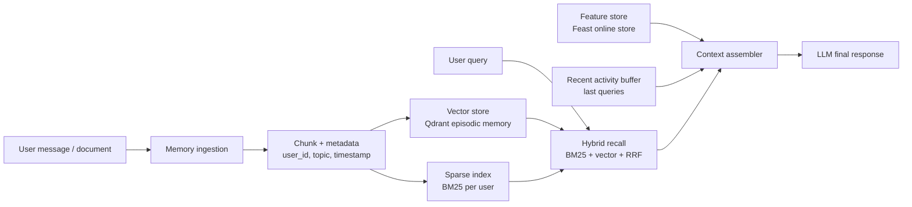

# Bonus Architecture - Hybrid Memory Assistant

**Contributor:** Lương Anh Tuấn  
**POC scope:** Trợ lý AI cá nhân cho người dùng Việt Nam, kết hợp episodic memory bằng vector store và stable/recent profile bằng feature store. Code demo không gọi LLM thật; nó assemble context để một LLM downstream có thể trả lời.

## Sơ đồ kiến trúc

## Quyết định 1: Chunking strategy

Tôi chọn chunk episodic memory theo **semantic-ish paragraph/message**, rồi cắt mềm khoảng 70-100 từ nếu đoạn quá dài. Mỗi chunk lưu `user_id`, `memory_id`, `timestamp`, `text`, và `topic_hint`. Lý do là memory cá nhân thường đến từ chat, note, hoặc đoạn tài liệu đã đọc; per-message giữ được intent gốc tốt hơn per-conversation, còn cắt paragraph giúp retrieval không phải kéo cả một cuộc hội thoại dài vào context.

Tradeoff chính là **retrieval quality vs storage cost vs context window**. Per-message rẻ và đơn giản nhưng đôi khi thiếu ngữ cảnh nếu user viết nhiều câu liên quan trong các message liền nhau. Per-conversation giữ đủ bối cảnh hơn nhưng dễ trả về chunk quá dài, tốn context window và làm embedding bị loãng. Semantic break bằng model riêng sẽ tốt hơn nhưng tăng complexity. Với POC này, paragraph/message + giới hạn từ là điểm cân bằng: đủ nhỏ để top-3 memory hữu ích, đủ rẻ để chạy local, và dễ giải thích.

## Quyết định 2: Feature schema

Tôi tách stable profile vào feature store theo entity `user_id`: `preferred_language`, `reading_speed_wpm`, `topic_affinity`. Recent activity cũng theo `user_id`: `queries_last_hour`, `distinct_topics_24h`; trong POC có thêm buffer local `recent_queries` để minh họa freshness tức thời. Pattern được chọn là **tabular features trước, embedding preferences sau**.

Tradeoff: tabular features dễ audit, dễ PIT join, TTL rõ ràng, và phù hợp với Feast. Ví dụ `topic_affinity=cloud` có thể dùng để personalize re-ranking hoặc recommend đọc tiếp. Embedding preference từ lịch sử user có thể mạnh hơn vì bắt được latent interests, nhưng khó giải thích và khó cập nhật đúng freshness. Trong lab bonus, mục tiêu là show judgment nên tôi ưu tiên schema đơn giản, có TTL và source rõ: profile daily/batch, query velocity streaming/hourly.

## Quyết định 3: Freshness strategy

Không phải memory nào cũng cần freshness giống nhau. Với use case "user vừa đọc xong tài liệu, hỏi ngay tài liệu đó nói gì", episodic memory nên phản ánh **sub-second đến vài giây** bằng write trực tiếp vào Qdrant, vì đây là trải nghiệm tương tác. Với "recommend đọc gì tiếp", `topic_affinity` có thể refresh **5 phút đến 1 giờ** nếu lấy từ session activity, hoặc daily nếu là stable profile. Với "trợ lý nhớ gì về tôi trong tháng này", memory consolidation/profile summary có thể chạy **daily**, vì độ ổn định quan trọng hơn tức thời.

Tradeoff là streaming Push API cho freshness tốt nhưng vận hành phức tạp và dễ ghi nhiễu vào profile nếu user chỉ tò mò tạm thời. Batch refresh đơn giản, rẻ, dễ kiểm soát chất lượng nhưng phản hồi chậm với hành vi mới. Vì vậy POC dùng đường nóng cho episodic write, feature store cho profile đã materialize, và buffer recent activity cho tín hiệu cực mới.

## Một lựa chọn đã loại bỏ

Tôi đã xem xét lưu toàn bộ episodic memory như một embedding feature view trong feature store. Tôi loại bỏ hướng này vì lifecycle của episodic memory và profile khác nhau: memory mới có thể đến từng phút và cần semantic top-K search, còn profile là feature tabular được join theo thời điểm, TTL, và phục vụ training/serving consistency. Tách Qdrant cho episodic và Feast cho profile giúp mỗi hệ thống làm đúng việc của nó.

## Lưu ý cho người dùng Việt Nam

User Việt Nam thường code-switch giữa tiếng Việt và English technical terms như "Kubernetes autoscaling", "cloud security", "độ trễ thấp". Vì vậy tokenization whitespace chỉ là baseline; production nên cân nhắc `underthesea` hoặc `pyvi`, nhưng cũng phải giữ nguyên technical tokens để BM25 không làm vỡ keyword tiếng Anh. Lỗi gõ không dấu, teencode, và typo phonetic cũng quan trọng; có thể thêm query normalization không dấu hoặc char n-gram retriever. Về riêng tư, memory cá nhân có thể chứa dữ liệu nhạy cảm, nên production cần isolation theo `user_id`, encryption at rest, quyền xoá memory, và chú ý Nghị định 13 về bảo vệ dữ liệu cá nhân.

## POC chưa xử lý

POC này chưa có mã hóa dữ liệu, xoá/sửa memory, đồng bộ đa thiết bị, memory decay, hay consolidation hàng tuần bằng LLM. Qdrant đang chạy in-memory nên mất dữ liệu khi process dừng. Feast lookup có fallback local để demo chạy được ngay cả khi online store chưa materialize; production không nên âm thầm fallback như vậy mà phải alert rõ.

## Vibe-coding workflow log

Prompt hiệu quả nhất là yêu cầu AI giữ code trong khoảng 100 dòng, không gọi LLM thật, chỉ assemble context và bám đúng pattern NB2/NB4. Prompt dễ fail là "build an AI memory system" quá rộng; nếu không khóa scope, AI thường viết quá nhiều abstraction và bỏ qua tradeoff TTL/PIT join.
